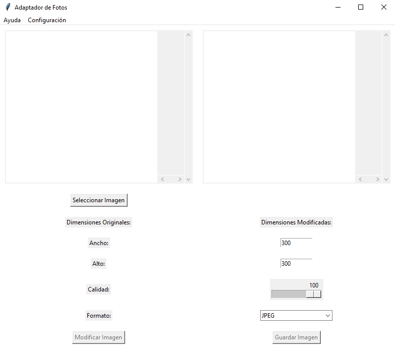
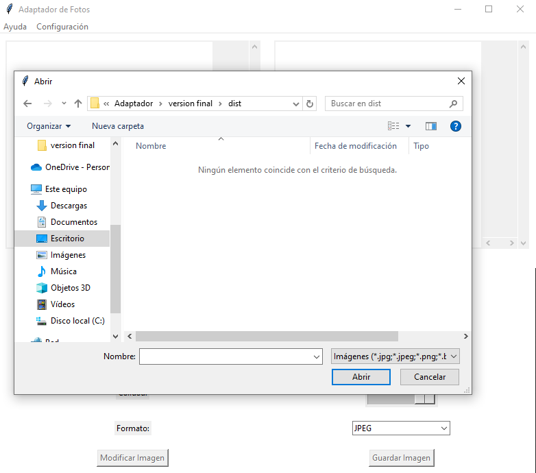
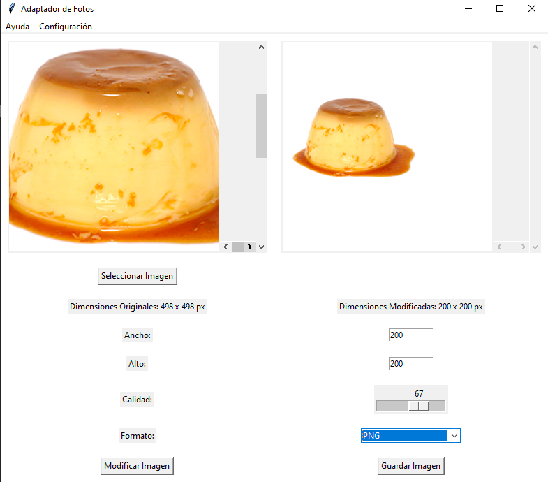
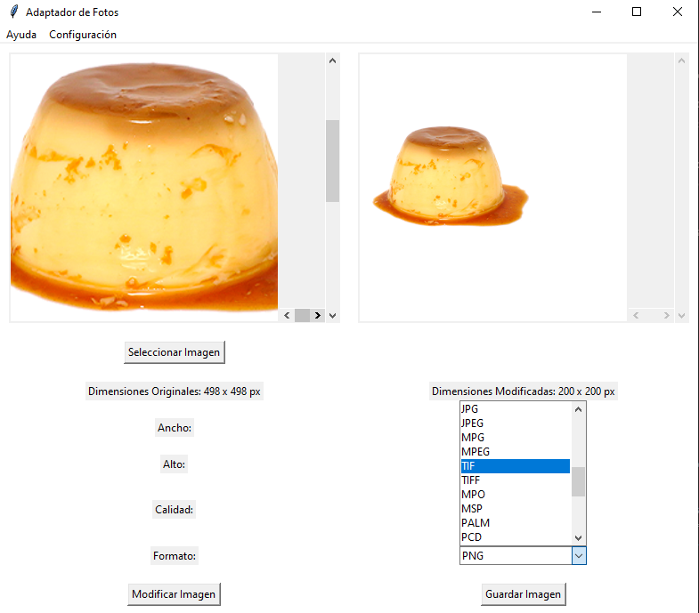
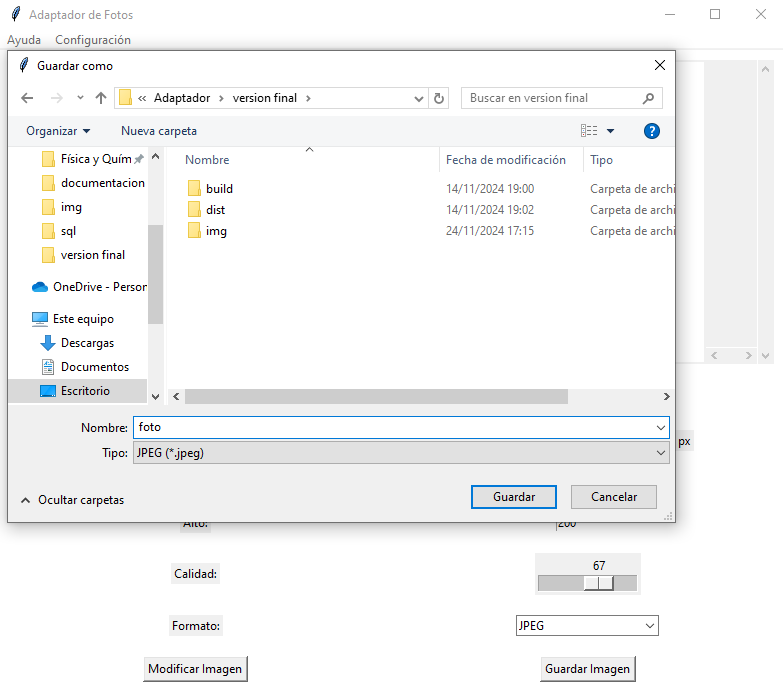
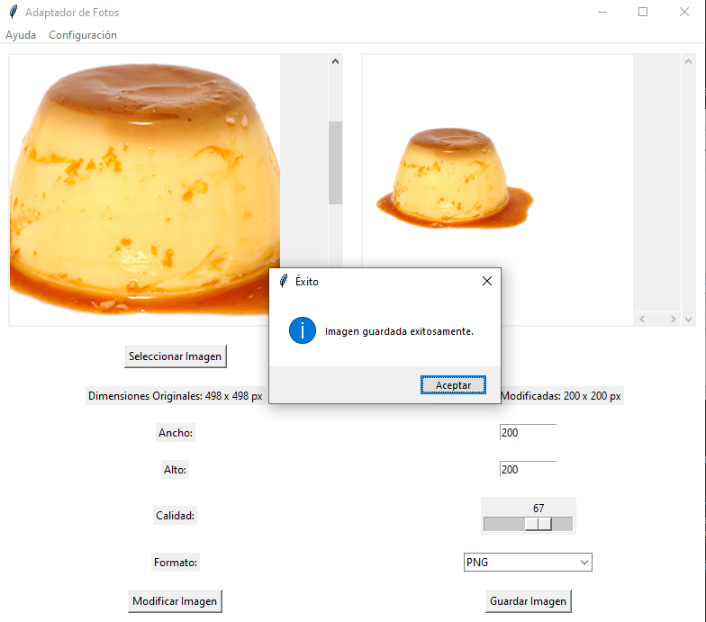

# Adaptador de fotos para sitios web

Las funciones que tiene el adaptador son las siguientes:
- Redimensionamiento automático: Ajusta el tamaño de las imágenes según las necesidades del diseño responsivo.
- Compresión: Reduce el tamaño del archivo para mejorar la velocidad de carga, sin perder calidad visual. 
- Conversión de formatos: Transforma las imágenes a formatos más eficientes como WebP u otros.
- Carga diferida (lazy loading): Carga las imágenes solo cuando son visibles en la pantalla."rchivo Excel resultante.

## Uso

1. **Abrir la aplicación**:
    - Al ejecutar el programa, se abrirá una ventana donde se podra seleccionar la imagen, modificar la foto y la calidad

    

2. **Seleccionar foto**:
    - Se abrirá una ventana para poder seleccionar la foto a transformas.

    

3. **Modificacion de dimension y calidad**:
    - Antes de la conversión, elige las nuevas dimensiones y la calidad de la foto. 

    

4. **Seleccion de formato**:
    - Después de modificar la foto con sus respectivas dimensiones y calidad, la aplicación podra cambiar el formato de la foto, de una foto con formato `.png` a una foto de formato `.jpeg` . El archivo resultante se podrá guardar en el formato seleccionado.

    

5. **Guardar foto**
    - Al ya tener el resultado final, se guarda la foto con su respectivo nombre.

    

6. **Alerta al guardar**
    - Al terminar el proceso, aparecera una alerta diciendo
    
    